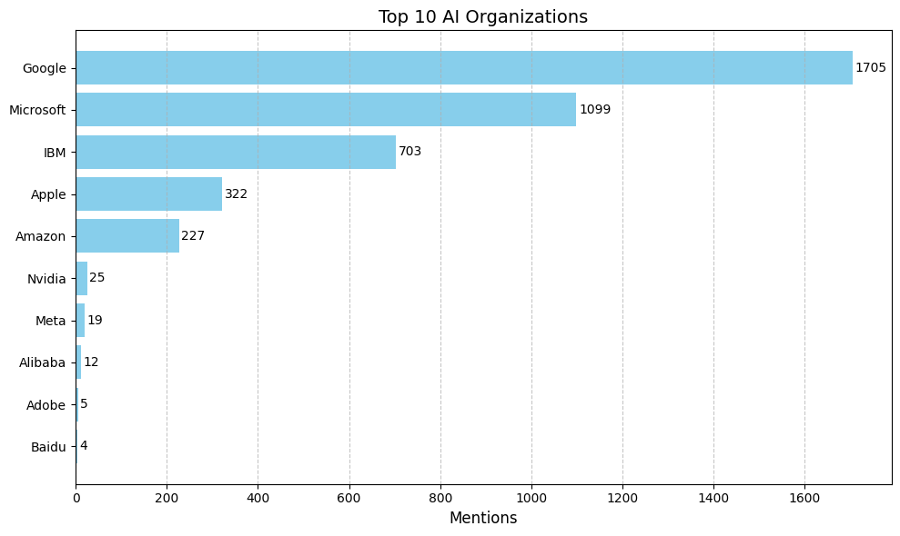

# How Media Coverage Influences Public Perception of AI

This project explores how artificial intelligence (AI) has been framed in mainstream media over the past 30 years, using **New York Times** articles as the primary data source. It applies sentiment analysis, topic modeling, and keyword extraction to headlines and abstracts to understand the evolution of media tone and themes related to AI.

## 📊 Research Objectives

- Analyze how media sentiment toward AI has changed over time (1994–2024)
- Identify dominant hopes and fears reflected in media narratives
- Extract recurring keywords and themes through topic modeling
- Examine how media framing may influence public trust, policy, and adoption of AI technologies

## 📰 Data

- **Source**: New York Times Archive API
- **Scope**: 30 years of monthly article metadata (1994–2024)
- **Fields Used**: `pub_date`, `headline`, `abstract`, `keywords`, `section_name`, `byline`

## 🧪 Methodology

- **Sentiment Analysis**: TextBlob-based polarity scoring on full-text and headlines
- **Topic Modeling**: LDA (Latent Dirichlet Allocation) to uncover dominant themes
- **Keyword Analysis**: TF-IDF to highlight prominent AI-related terms across time periods
- **Data Preprocessing**: Tokenization, stopword removal, lemmatization

## 📁 Project Structure

## 📊 Key Findings

### 1. 📈 Media Sentiment Toward AI Over Time
  
**Figure 6.** *Yearly proportion of AI articles by sentiment*  
> Positive sentiment dominated until 2020, after which negative sentiment increased sharply, reflecting rising public concern over misinformation, automation, and ethics.
---

### 2. 🧭 Daily Sentiment Balance of AI Articles
  
**Figure 7.** *Smoothed Daily AI Sentiment Balance (1994–2024)*  
> This index shows sentiment swings throughout decades, with sharp drops after major AI milestones like GPT-3 and ChatGPT.

---

### 3. 📉 Recent Sentiment Breakdown (Post-2015)
  
**Figure 8.** *Smoothed Sentiment Index (2015–2024)*  
> Sentiment became more polarized after 2020, coinciding with GPT-3, ChatGPT, and regulatory debates.

---

### 4. 🧾 Sentiment Distribution of Articles
  
**Figure 4.** *Overall Distribution of Sentiment in AI Coverage*  
> Most AI-related news articles are positive, but the influence of negative articles—especially in recent years—is growing.

---

### 5. 🏢 Top Organizations in AI News
  
**Figure 9.** *Most Mentioned AI Companies in Media (1994–2024)*  
> Google, Microsoft, and IBM dominate media coverage, shaping the public narrative around AI development and leadership.

---

### 6. 🔍 Evolution of AI-Related Keywords
  
**Figure 10.** *Top Keywords in AI Articles by 5-Year Period*  
> Keyword analysis shows shifting themes from early infrastructure (chips, robotics) to modern concerns (ChatGPT, OpenAI, DeepSeek).

---

## 🧪 Methodology Overview

### Pipeline Overview
  
> Articles were filtered with regex and transformers, followed by sentiment analysis, topic modeling (LDA), and NER.

### Filtering Stages
  
> From 2.7M articles, only 6884 were classified as AI-related.

### Topic Model Selection
  
> Coherence peaked at 8 topics—used for final thematic analysis.
